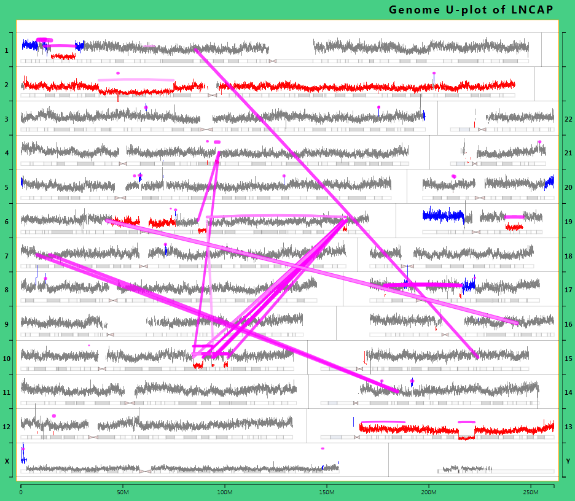

# Genome U-Plot sample implementation 

The Genome U-Plot is a JavaScript tool to visualize Chromosomal abnormalities in the Human Genome using a U-shape layout. 


Whole Genome U-Plot. Visible are the 24 human chromosomes arranged in a U-shape, the cytobands, the chromosome junctions and the copy number variations (CNVs). The axes at the bottom right of the graph are respectively for the chromosomes on the right side of the plot.


## Node
> **[Node.js](https://nodejs.org/)** is an open-source, cross-platform JavaScript runtime environment for developing a diverse variety of server tools and applications.

We use Node for basically everything in this project, so we are going to need it. Please visit the [download page](https://nodejs.org/en/download/current/) for **macOS** or **Windows** binaries, or the [package manager installations page](https://nodejs.org/en/download/package-manager/) for Linux distributions.

In this project we used Node.js v6.10.0 LTS.

## Node Version Management Tools
If you need the flexibility to use multiple versions of Node, check out [NVM](https://github.com/creationix/nvm) or [Windows NVM](https://github.com/coreybutler/nvm-windows).

## NPM
NPM is the default package manager for Node. It is automatically installed alongside with Node. Package managers are used to install and manage packages (modules of code that you or someone else wrote). We are going to use a lot of packages but we'll use **Yarn**, another package manager.

## Yarn
> **[Yarn](https://yarnpkg.com/)** is a Node.js package manager which is much faster than NPM, has offline support, and fetches dependencies [more predictably](https://yarnpkg.com/en/docs/yarn-lock).

### To install yarn
Use **NPM** and run:
```
> $ npm install --global yarn
```

### To install the project dependencies
Start a command shell, change directory to the directory of the project and install the project dependencies using:
```
> $ yarn install
```

### To run the project
Use: 
```
> $ yarn start
```
Using a modern browser visit:
```
http://localhost:8000/GenomePlot.html?sampleId=LNCAP
```

## Data Visualization

A sample (LNCAP) with all required files is provided in the `public/data` directory
```
LNCAP/LNCAP_alts_comprehensive.csv  (Sample Rearrangements)
LNCAP/LNCAP_cnvIntervals.csv        (Sample Copy Number Variation - Intervals)
LNCAP/LNCAP_genomePlot_cnv30.json   (Sample Copy Number Variation - Raw Frequency)
LNCAP/LNCAP_visualization.json      (Sample Definition)
```

In order to run the application against a different sample (eg. MY_SAMPLE) you need to create an appropriate directory and file structure replacing for example LNCAP with MY_SAMPLE. Finally don't forget to replace your sample name in the URL parameter of the app.

### Reference file

-   A Human Genome Assembly GRCh38 cytobands reference file is provided by the visualization (`public/reference/cytobands/hg38/cytoBand.json`), however if you want to use your own you may download and uncompress a definition file from <ftp://hgdownload.cse.ucsc.edu/goldenPath/hg38/database/cytoBand.txt.gz>. 
Then you must convert the file to a json format of the following form:
```
[
    {
        chrom: "chr1",
        chromStart: 0,
        chromEnd: 2300000,
        gieStain: "gneg",
        name: "p36.33"
    }, {
        chrom: "chr1",
        chromStart: 2300000,
        chromEnd: 5300000,
        gieStain: "gpos25",
        name: "p36.32"
    },
    ...
]
```

### Sample Definition

A sample specific json file must be provided (as in `LNCAP\LNCAP_visualization.json`):
```
{
    fileFormatVersion: 1,    
    altsComprehensive: "sampleId_alts_comprehensive.csv",
    cnvBinned30KJson: "sampleId_genomePlot_cnv30.json",
    cnvIntervals: "sampleId_cnvIntervals.csv"
}
```

### Sample Rearrangements

In order to visualize chromosomal rearrangements, a csv file is required (as in `LNCAP/LNCAP_alts_comprehensive.csv`) and the following columns of integers must be supplied:
```
Nassoc,chrA,chrB,posA,posB
```
where *Nassoc* is the number (integer) of supporting fragments of the events.

### Sample Copy Number Variation

In order to visualize copy number, two files of a specific format must be supplied. First, a file (as in `LNCAP/LNCAP_genomePlot_cnv30.json`) with the raw frequency data from a 30000 bin moving window.

The second file contains the copy number state information; a csv file (as in `LNCAP/LNCAP_cnvIntervals.csv`) with the following columns must be supplied:
```
chr,start,end,cnvState,nrd
```
where *cnvState* is one of 1 (loss), 2 (normal) or 3 (gain) and *nrd* is a floating point value corresponding to the Normalized Read Depth score that provides a quantitative measure of how far the CNV deviates from the calculated normal level (*nrd* = 2.0).

## Variant Call Format (VCF) file Support

In order to run the application against a sample that is stored in a **VCF** file, we provide an **R** script `vcftoUplot.R` (which resides in the `public/data` directory). The script was tested with R-3.3.3 and requires the R package `VariantAnnotation`, which will be automatically installed if not present. The script takes as input a **VCF** file (tested VCF v4.1 and v4.2) and produces the file structure hierarchy required by the Genome U-Plot in order to visualize the sample. Finally don't forget to replace your sample name in the URL parameter of the app.

### To run `vcftoUplot.R`

Given a **VCF** sample file NA12878.vcf (provided in the `public/data` directory), run
```
Rscript vcftoUplot.R NA12878.vcf
```

This will produce the following directory hierarchy 
```
NA12878/
├── NA12878_alts_comprehensive.csv
└── NA12878_visualization.json
```

Then, using a modern browser visit:
```
http://localhost:8000/GenomePlot.html?sampleId=NA12878
```

**Note:** For this particular example you should use the *"Filter on # of Frags"* GUI option in order to reduce the number of visualized Chromosomal abnormalities. You can also uncheck the *"Line width to # Frags"* to disassociate the line thickness from the number of fragments supporting the event. 

**Note II:** The Human Genome Assembly GRCh38 is assumed
